# 📋 Dokumentasi Voca Task

Dokumentasi ini menjelaskan cara menggunakan website **Voca Task** untuk login, mengelola tugas, dan mengedit profil pengguna. Setiap langkah dilengkapi dengan deskripsi dan screenshot untuk mempermudah pengguna memahami fitur yang tersedia.

---

## 📖 Daftar Isi

1. [🔑 Halaman Login](#1--halaman-login)
   - [✅ Cara Masuk ke Akun](#cara-masuk-ke-akun)
2. [📝 Halaman Tugas](#2--halaman-tugas)
   - [✅ Cara Mengelola Tugas](#cara-mengelola-tugas)
3. [👤 Halaman Edit Profil](#3--halaman-edit-profil)
   - [✅ Cara Mengedit Profil](#cara-mengedit-profil)
4. [🎯 Tips & FAQ](#4--tips--faq)

---

## **1. 🔑 Halaman Login**

Halaman login digunakan untuk masuk ke akun Anda di Voca Task. Ikuti langkah-langkah berikut untuk mengakses akun Anda.

### **✅ Cara Masuk ke Akun**

#### **1. Buka Halaman Login**
Saat membuka website, Anda akan diarahkan ke halaman login. Halaman ini memiliki formulir dengan kolom **Email** dan **Password**.

---

#### **2. Masukkan Alamat Email**
- Ketik alamat email Anda di kolom **Email**.
- **Tips**: Pastikan menggunakan format yang benar (contoh: `john@example.com`).

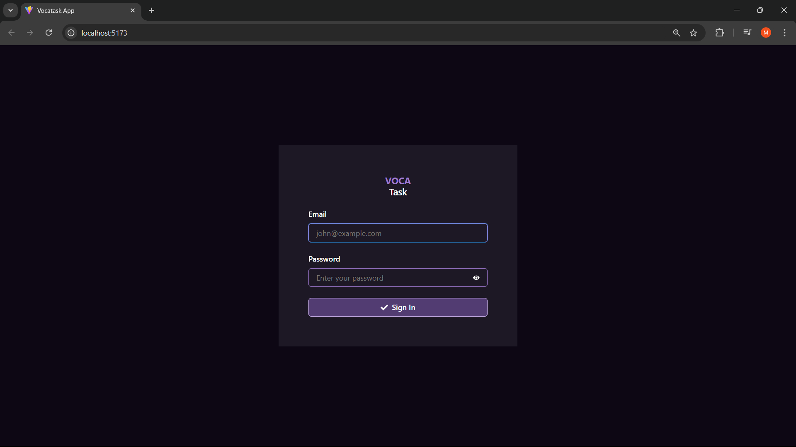

---

#### **3. Masukkan Kata Sandi**
- Ketik kata sandi Anda di kolom **Password**.
- Klik ikon mata di samping kolom untuk menampilkan atau menyembunyikan kata sandi.

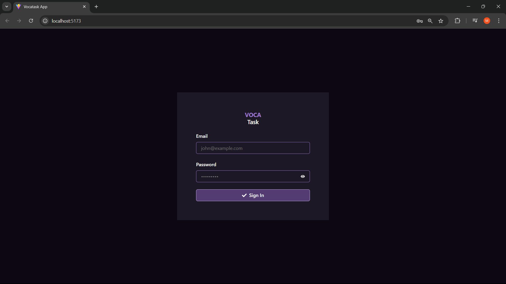  

---

#### **4. Klik Tombol Sign In**
- Klik tombol **Sign In**.
- Jika berhasil, Anda akan diarahkan ke halaman tugas dengan pesan sukses.

- Jika email atau kata sandi salah, pesan kesalahan akan muncul.

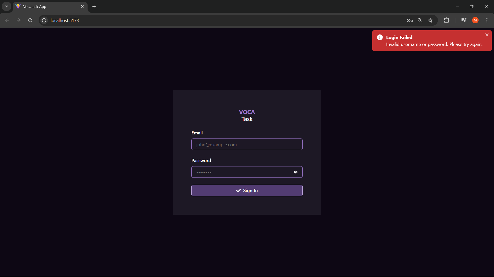

---

## **2. 📝 Halaman Tugas**

Halaman tugas digunakan untuk mengelola daftar tugas Anda, seperti menambahkan, menandai selesai, dan menghapus tugas.

### **✅ Cara Mengelola Tugas**

#### **1. Menambahkan Tugas Baru**
- Masukkan judul tugas di kolom input yang tersedia.
- Klik tombol **Add** atau tekan **Enter** untuk menambahkan tugas baru.

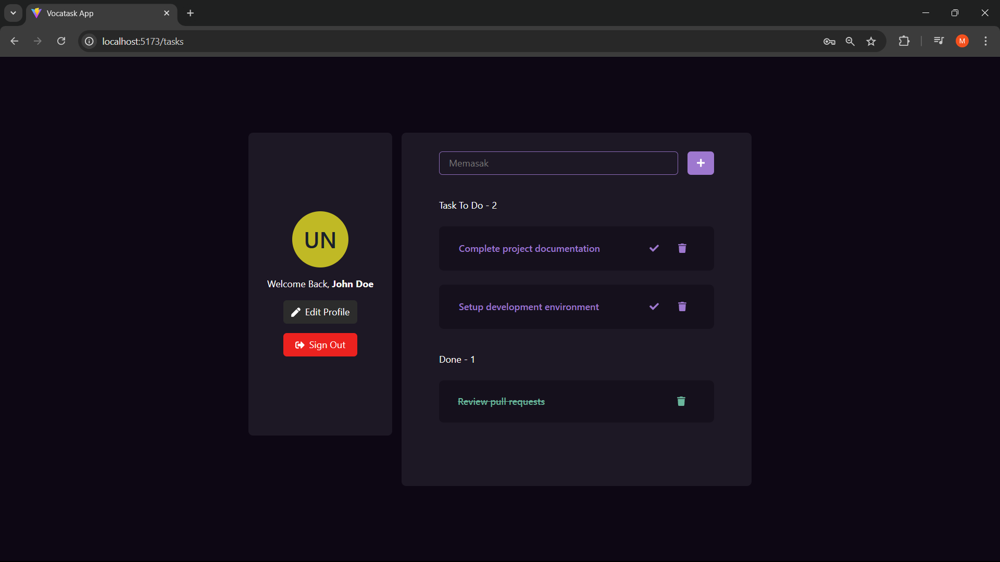  
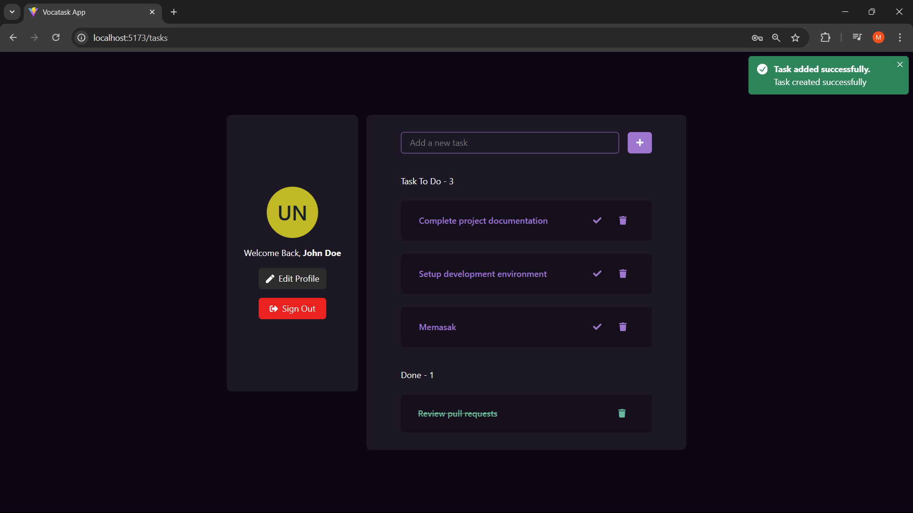

---

#### **2. Melihat Tugas yang Belum Selesai (To Do)**
- Tugas yang belum selesai akan muncul di bagian **Task To Do**.
- Anda dapat melihat daftar tugas beserta opsi untuk menyelesaikan atau menghapusnya.

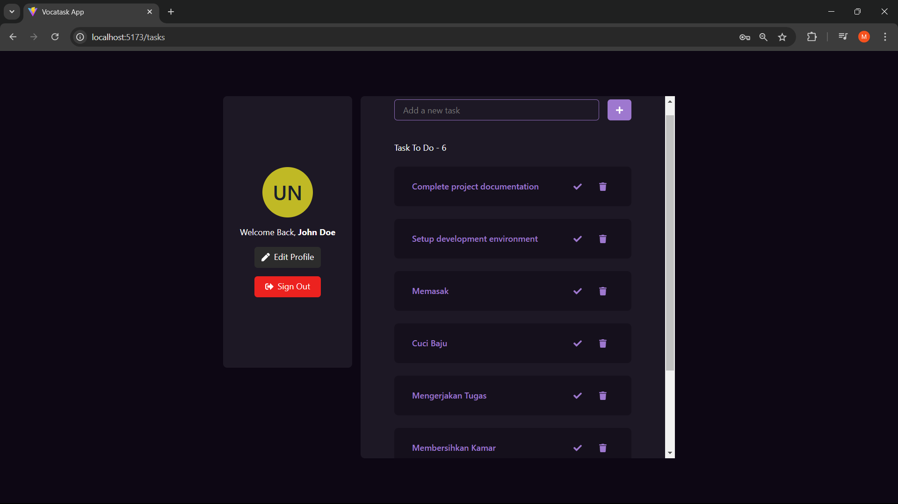

---

#### **3. Menandai Tugas sebagai Selesai**
- Klik tombol **Done** di samping tugas untuk memindahkannya ke bagian **Done**.

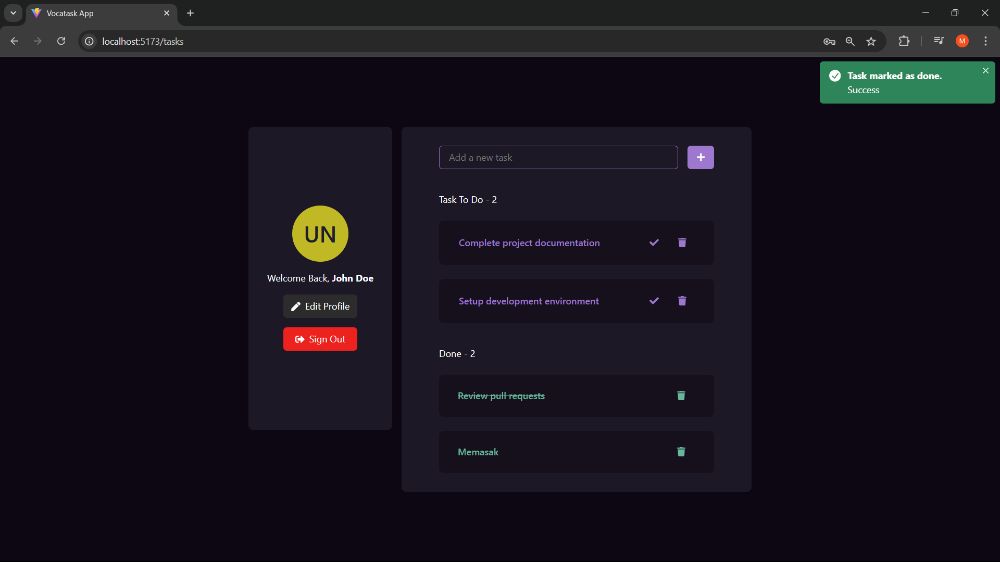

---

#### **4. Melihat Tugas yang Selesai (Done)**
- Tugas yang telah selesai akan muncul di bagian **Done**.

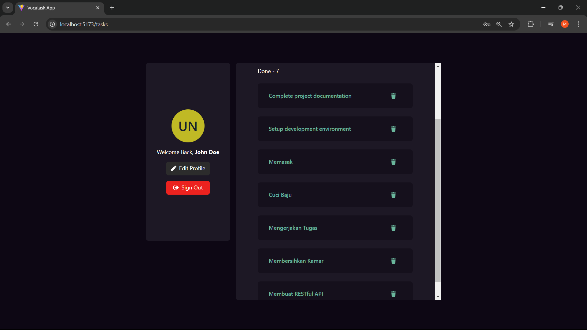

---

#### **5. Menghapus Tugas**
- Klik tombol **Delete** di samping tugas untuk menghapusnya dari daftar.
- Konfirmasikan penghapusan jika diminta.

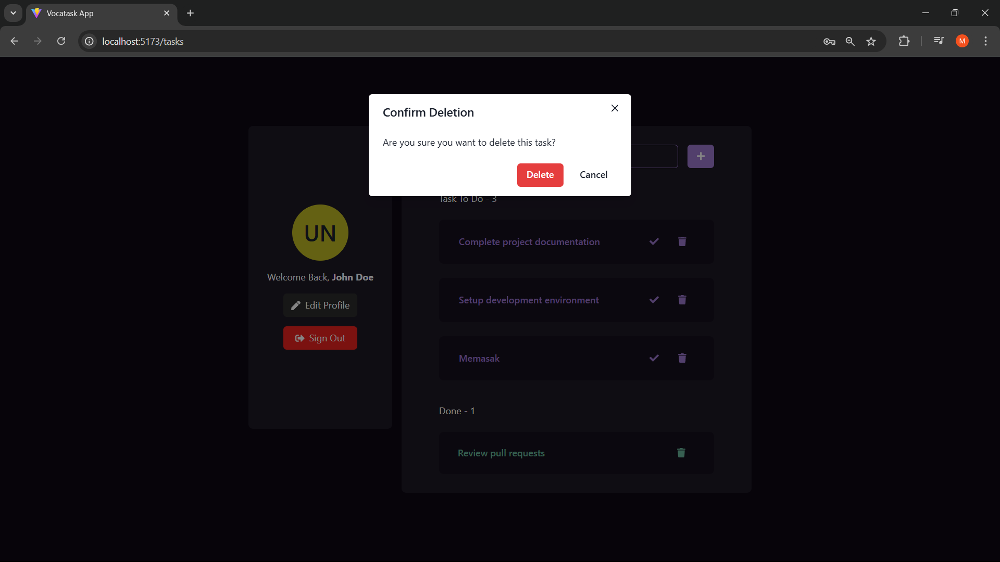  

---

## **3. 👤 Halaman Edit Profil**

Halaman edit profil memungkinkan pengguna untuk memperbarui informasi akun mereka, seperti nama, email, dan foto profil.

### **✅ Cara Mengedit Profil**

#### **1. Buka Halaman Edit Profil**
- Klik navigasi ke menu **Edit Profile**.
- Anda akan diarahkan ke halaman untuk mengubah foto profil, nama, email, dan kata sandi.

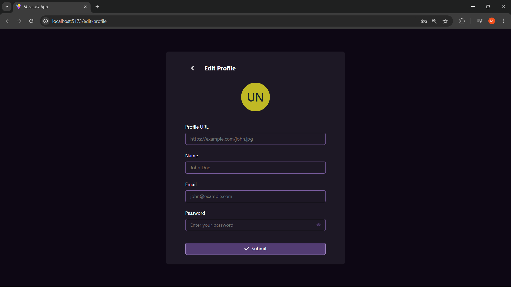

---

#### **2. Mengubah Foto Profil**
- Masukkan URL gambar yang valid pada kolom **Profile URL**.

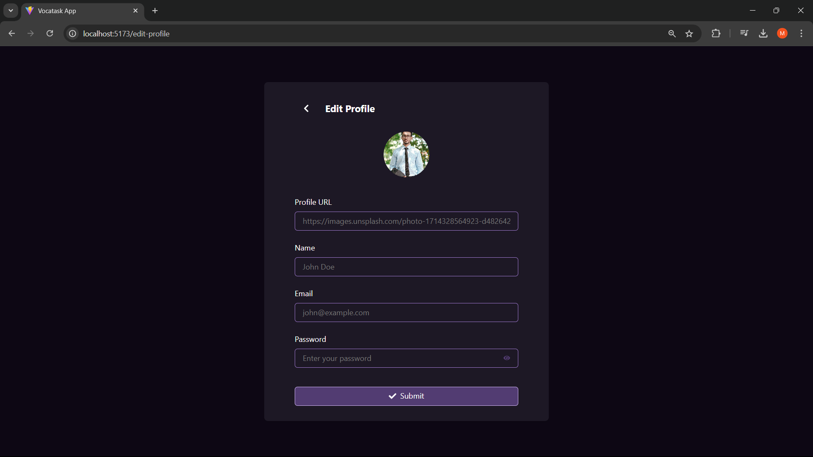

---

#### **3. Mengubah Nama**
- Ketik nama baru pada kolom **Name**.

---

#### **4. Mengubah Email**
- Masukkan alamat email baru pada kolom **Email**.
- **Tips**: Pastikan menggunakan format email yang benar.

---

#### **5. Mengubah Kata Sandi**
- Ketik kata sandi baru di kolom **Password**.
- Klik ikon mata untuk menampilkan atau menyembunyikan kata sandi.

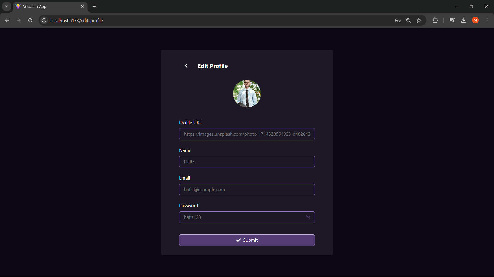  

---

#### **6. Menyimpan Perubahan**
- Klik tombol **Submit** untuk menyimpan perubahan.
- Jika berhasil, pesan konfirmasi akan muncul.

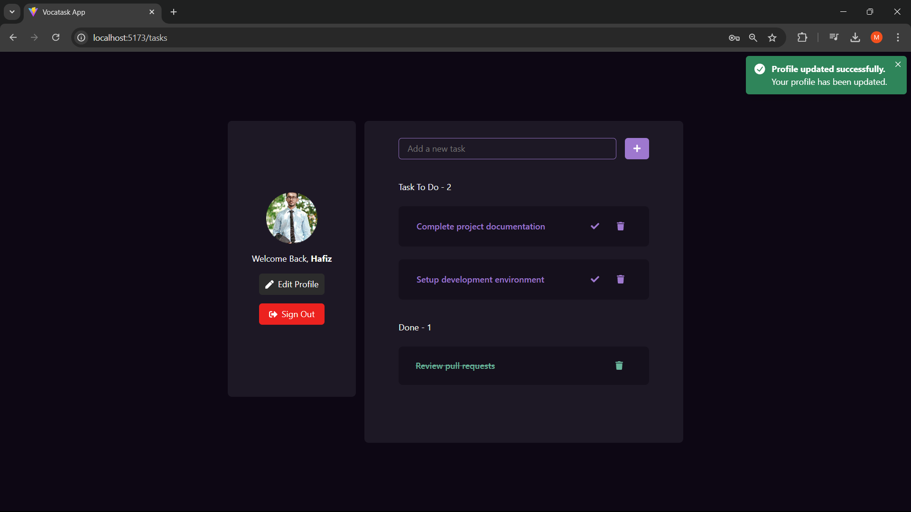

---

## **4. 🎯 Tips & FAQ**

### **💡 Tips**
- **Gunakan Kata Sandi Kuat**: Kombinasikan huruf besar, kecil, angka, dan simbol untuk keamanan lebih baik.
- **Perbarui Profil Berkala**: Pastikan data Anda selalu terkini.

---

### **❓ FAQ**

1. **Bagaimana cara menghapus semua tugas sekaligus?**  
   Saat ini, tugas hanya bisa dihapus satu per satu.
